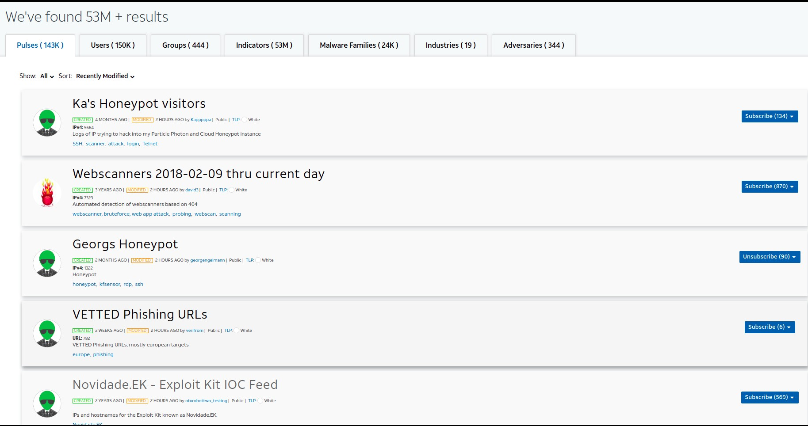
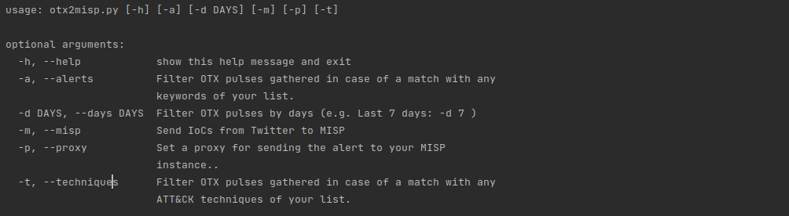

**Work in progress. The script is not finished yet.**

**otx_2misp**  
This script allows you to gather Indicator of Compromise (IoCs) from your [OTX](https://otx.alienvault.com/) suscribed pulses and send them to MISP
for Threat Intelligence analysis. The script uses the [OTX Python SDK](https://github.com/AlienVault-OTX/OTX-Python-SDK) and [PyMISP](https://github.com/MISP/PyMISP) 
Python libraries.

The script needs the following configuration:
* config->**config.ini**: OTX configuration, MISP url and MISP API key.
* config->**keywords.txt**: The terms that you to want to monitor on your Pulses.
* config->**attack_ids.txt**: ATT&CK techniques for filtering Pulses related to these techniques. (e.g. T1078 that stands for ATT&CK Enterprise Valid accounts)

**How it works?**

The first step is to have an OTX-AlienVault account, and you have also to be subscribed to at least one pulse. If you don't have it, you'll have to create 
an OTX-AlienVault account and to choose what pulses suit with your interests.



   
**Usage**

```bash 
python otx2misp.py
```

**Output**
```
[*] Searching for Pulses on OTX:
	[+] New OTX Pulse by AlienVault created: 2021-06-03T11:24:40.517000
		 [-] This pulse was edited: 2021-06-03T11:24:40.517000
		 [-] Title: SharpPanda Targets Southeast Asian Government With Previously Unknown Backdoor
		 [-] ID: 60b8bbf9744408d3a83062f7
		 [-] TLP: white
		 [-] Description: Check Point Research identified an ongoing surveillance operation targeting a Southeast Asian government. The attackers use spear-phishing to gain initial access and leverage old Microsoft Office vulnerabilities together with the chain of in-memory loaders to attempt and install a previously unknown backdoor on victim’s machines.
		 [-] Malware families: ['MClient', 'VictoryDll', 'RoyalRoad', 'Cobalt Strike - S0154', 'SharpM']
		 [-] Targeted countries: Unknown
		 [-] Adversary: SharpPanda
		 [-] ATT&CK Techniques: ['T1566.001', 'T1204.002', 'T1203', 'T1059.003', 'T1053', 'T1027', 'T1221', 'T1082', 'T1518', 'T1057', 'T1012', 'T1007', 'T1081', 'T1010', 'T1113', 'T1005', 'T1132', 'T1104', 'T1071', 'T1573.001', 'T1041', 'T1529']
		 [-] Tags: #cobaltstrike #SharpPanda #RoyalRoad #VictoryDLL #MClient #SharpM
		 [-] References: 
			 [+] link: https://research.checkpoint.com/2021/chinese-apt-group-targets-southeast-asian-government-with-previously-unknown-backdoor/
		 [-] IoCs associated with this pulse:
			 [-] New IoC with ID: 3023387166
				 [-] IoC: d843b58f31c687d22de09a6765b3ba3b
				 [-] type: FileHash-MD5
				 [-] created: 2021-06-03T11:24:42
				 [-] title: ALF:Trojan:Win32/MeterLoad
		 [-] New IoC with ID: 3023387180
				 [-] IoC: b40476638c83b8800413cf1fe88e28c2486367b79d1ddae7eb1ddcfa75ceb0e3
				 [-] type: FileHash-SHA256
				 [-] created: 2021-06-03T11:24:42
				 [-] title: Trojan:Win32/Tiggre!rfn
				 [-] description: SHA256 of 7a38ae6df845def6f28a4826290f1726772b247e		 [-] description: MD5 of 176a0468dd70abe199483f1af287e5c5e2179b8c  
```
The script gathers OTX pulses, and it prints them to the console. By default, the script
doesn't filter any pulse. However, the script allows you to narrow the number of Pulses gathered filtering in 2 different ways:
* By keyword (config->**keywords.txt**) using -a parameter (e.g. Dridex, Web Shell, etc).
* By ATT&CK technique (config->**attack_ids.txt**) using -t parameter (e.g. T1078)




By default, the script gathers pulses from the last 7 days, but it can be modified with the parameter -d. For instance, 
-d 20 for gathering pulses from the last 20 days.

```bash 
python otx2misp.py -d 2
```

**Sending alerts to MISP**

The alerts gathered can be sent to your [MISP](https://www.misp-project.org/) instance with the -m parameter. The script
also allows using a proxy for the connection with the [MISP](https://www.misp-project.org/) instance using the parameter -p.

For instance, the command below is for gathering all the pulses from the last 2 days, filtering those pulses that match 
with your keywords and ATT&CK techniques. Finally, the pulses filtered will be sent to your MISP instance using a proxy. 

```bash 
python otx2misp.py -d 2 -a -t -m -p
```